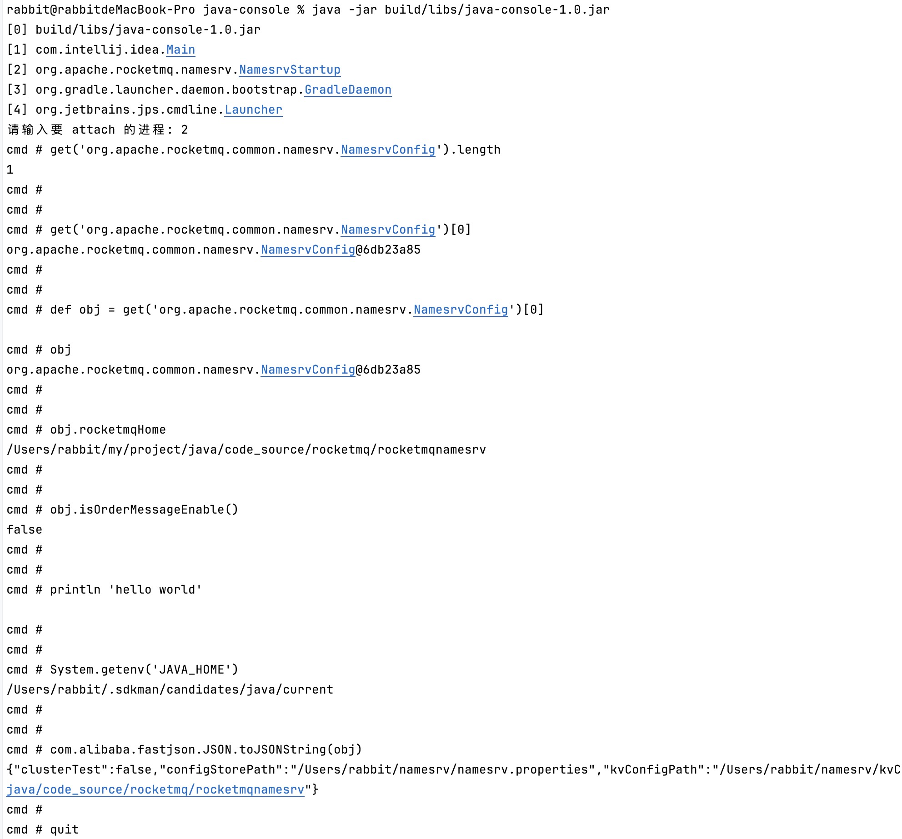

# JAVA 控制台
一款能够直接对任意 java 进程进行调试的工具

### 使用说明
1、运行工具
```bash
java -jar java-console-1.0.jar
```

2、选择需要调试的 java 进程
```bash
[0] build/libs/java-console-1.0.jar
[1] com.intellij.idea.Main
[2] org.apache.rocketmq.namesrv.NamesrvStartup
[3] org.gradle.launcher.daemon.bootstrap.GradleDaemon
[4] org.jetbrains.jps.cmdline.Launcher
请输入要 attach 的进程: 2
```

3、具体命令

说明：get() 函数是内部函数，作用是根据类名获取所有实例，返回的是个实例数组

```bash
# 获取类的实例数量
get('org.apache.rocketmq.common.namesrv.NamesrvConfig').length
1

# 获取类的实例
get('org.apache.rocketmq.common.namesrv.NamesrvConfig')[0]
org.apache.rocketmq.common.namesrv.NamesrvConfig@33068907

# 将类赋值给变量
def obj = get('org.apache.rocketmq.common.namesrv.NamesrvConfig')[0]

# 直接获取变量
obj
org.apache.rocketmq.common.namesrv.NamesrvConfig@33068907

# 直接获取对象变量
obj.rocketmqHome
/Users/rabbit/my/project/java/code_source/rocketmq/rocketmqnamesrv

# 调用对象方法
obj.isOrderMessageEnable()
false

# 在控制台打印，内容会打印在进程日志中
println 'hello world'

# 调用系统方法
System.getenv('JAVA_HOME')
/Users/rabbit/.sdkman/candidates/java/current

# 调用静态方法，需要写全限定类名
com.alibaba.fastjson.JSON.toJSONString(obj)
{"clusterTest":false,"configStorePath":"/Users/rabbit/namesrv/namesrv.properties","kvConfigPath":"/Users/rabbit/namesrv/kvConfig.json","orderMessageEnable":false,"productEnvName":"center","rocketmqHome":"/Users/rabbit/my/project/java/code_source/rocketmq/rocketmqnamesrv"}

# 退出
quit
```


